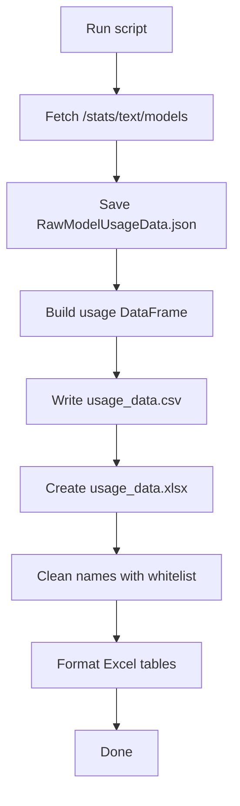

# AI-Horde Popular Tag Automation Tool

This project provides a small Python utility for retrieving popularity information about text models from the [AI Horde](https://aihorde.net/) API. It fetches usage statistics, writes them to CSV and Excel files, and normalises model names using an optional whitelist.

The script performs the following steps:
1. Fetch `/api/v2/stats/text/models` from the AI Horde API.
2. Save the raw JSON as `RawModelUsageData.json` inside the `user-files` folder.
3. Convert the data to `usage_data.csv`.
4. Create `usage_data.xlsx` with **Day**, **Month**, and **Total** sheets.
5. Normalize model names using `models.csv` if provided.
6. Save the cleaned tables back to `usage_data.xlsx`.

## Quick start

1. **Clone the repository** and create a virtual environment:  
   Bash:
   ```bash
   python3 -m venv .venv
   source .venv/bin/activate
   pip install -r requirements.txt
   ```
    PowerShell:
   ```powershell
   python -m venv .venv
   .venv\Scripts\Activate.ps1
   pip install -r requirements.txt
   ```

2. (Optional) Place a `models.csv` whitelist in the `user-files` directory.
3. **Run the script**:

   ```bash
   python AI_Horde_Popular_Tag_Automation_Tool.py
   ```

   The `user-files` folder will then contain `usage_data.csv`, `usage_data.xlsx` and `RawModelUsageData.json`.

## Diagram



## Contributing

Bug reports and pull requests are welcome! See [CONTRIBUTING.md](CONTRIBUTING.md) for development guidelines.
